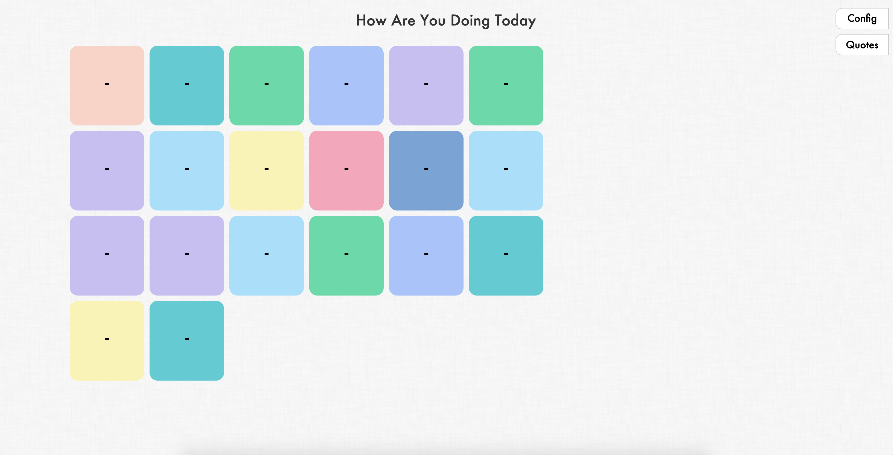

# Home Blocks

A Simple Customisable Home Page Chrome Extension built using [svelte](https://svelte.technology/)



# Getting Started

## Install from Chrome Web Store

Coming Soon

## Building from source

*Note that you will need to have [Node.js](https://nodejs.org) and Yarn installed.*

```bash
  yarn install
  yarn build
```

The final build will be in home-blocks folder.
* Go to Manage Extensions in Chrome
* Select Developer Mode
* Load Unpacked

## Website

Coming Soon

## To-Do
* Work to Release Milestone (v1.0.0)
* Add Test Cases
* Publish to Chrome Web Store

## License

Home Blocks is licensed under MIT License
